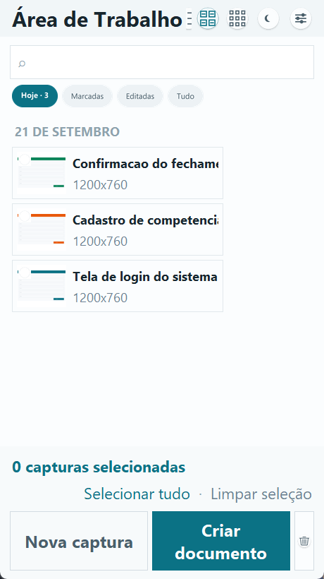
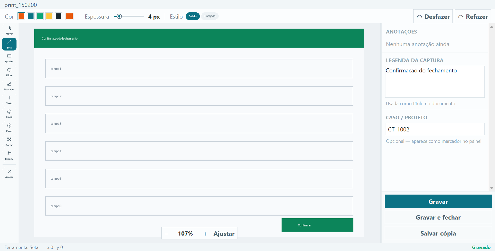
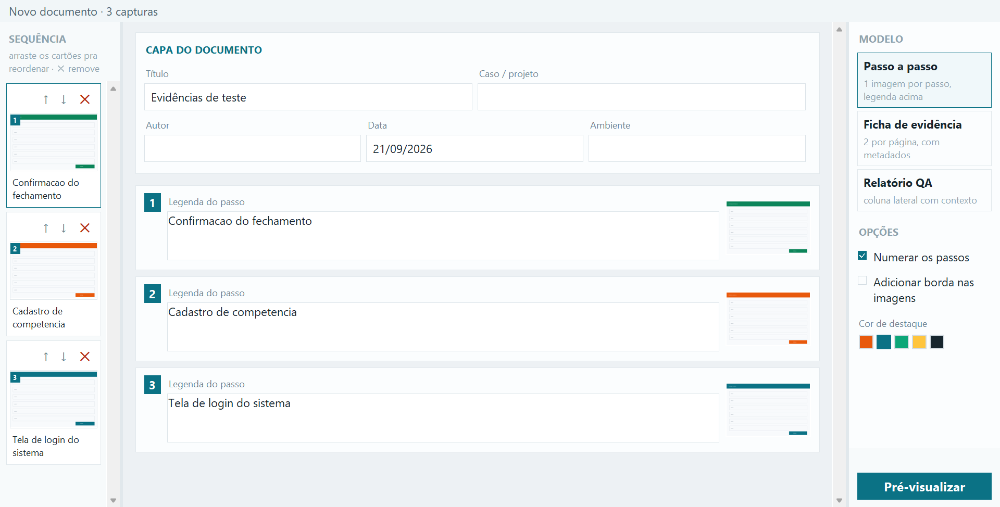
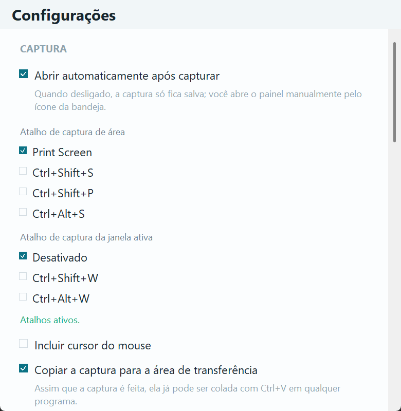

# 📸 Gestor de Evidências

Aplicativo de desktop para Windows que captura, anota e transforma prints em
documentos de evidência de teste — em PDF ou DOCX, prontos para anexar.

---

## 📝 Sobre

Evidência de teste costuma nascer espalhada: o print sai para a Área de
Trabalho, a legenda vai para um bloco de notas, e a montagem do documento vira
um trabalho manual de colar imagem no Word, redimensionar, escrever embaixo e
repetir. Quando o caso precisa ser revisto semanas depois, ninguém sabe qual
print era de qual passo.

O Gestor de Evidências fecha esse caminho inteiro numa ferramenta só: você
aperta Print Screen, seleciona a área, anota em cima da imagem, escreve a
legenda e o caso, e no fim escolhe um dos três modelos de documento. O
resultado sai numerado, com capa preenchida e rodapé padronizado.

**Para quem foi feito:** QA, analistas de teste, suporte e quem precisa
entregar evidência de execução com alguma regularidade.

**Onde os dados ficam:** tudo é local. Não há servidor, conta, nuvem nem envio
de nada para fora da máquina.

---

## ✨ Funcionalidades

- 📸 Captura de área da tela, com atalho global (funciona com o app escondido)
- 🪟 Captura da janela ativa, com detecção automática da borda real
- 🎯 Sugestão da área de captura por detecção de bordas
- ✏️ Editor de anotação: seta, quadro, elipse, marcador, texto, emoji, passo
  numerado, borrão e recorte
- 🖍️ Borrão para ocultar dado sensível antes de a evidência sair da máquina
- 🏷️ Legenda e Caso/Projeto por captura
- 🔎 Busca por nome do arquivo, legenda ou caso/projeto
- 🗂️ Filtros: Hoje, Marcadas (as selecionadas para o documento), Editadas, Tudo
- 👁️ Três visualizações da lista: detalhes, blocos e grade
- 📄 Três modelos de documento: Passo a passo, Ficha de evidência e Relatório QA
- 👀 Pré-visualização na mesma escala do documento antes de gerar
- 📎 Exportação em PDF e DOCX
- 📋 Ctrl+C copia a captura como imagem **e** como arquivo (cola no Word ou anexa no e-mail)
- 🗑️ Exclusão para a Lixeira do Windows, com volta
- 🧹 Limpeza automática por tempo de retenção
- 🌓 Modo claro e escuro
- 🔠 Tamanho de fonte ajustável, incluindo o dos botões
- 🚀 Início com o Windows e atalho no menu Iniciar
- 🔔 Ícone na bandeja, com o painel escondendo-se por inatividade

### 🚧 Ainda não existe

- [ ] OCR / busca por texto dentro da imagem
- [ ] Organização em projetos/pastas dentro do app (hoje a organização é por
      pasta do sistema + campo Caso/Projeto + filtros)

Integração com Jira ou Azure DevOps **está fora do escopo**: o documento
gerado é anexado manualmente onde for preciso, e o projeto fica no GitHub.
- [ ] Reorganização do código em pacotes por camada (ver [Roadmap](#️-roadmap))
- [ ] Versionamento em Git — **o projeto ainda não está sob controle de versão**

---

## 🖥️ Telas

### Painel principal



### Editor de anotação



### Montar documento



### Configurações



> As capturas acima usam imagens sintéticas de propósito: print de evidência
> pode conter dado de cliente, e o README vai para o repositório.

---

## 🛠️ Tecnologias

| Camada | O que usa |
|---|---|
| Linguagem | Python 3.13 |
| Interface | Tkinter + tkinterdnd2 (arrastar e soltar) |
| Imagem | Pillow, NumPy (detecção de bordas) |
| Integração Windows | pywin32, comtypes (UI Automation), pystray, screeninfo |
| Documentos | fpdf 1.7 (PDF), python-docx (DOCX) |
| Empacotamento | PyInstaller (`--onedir`) |
| Testes | Robot Framework + cenários em Python |

---

## 🏗️ Arquitetura

Aplicação de desktop de processo único. Não há frontend/backend, API nem banco
de dados: a interface, as regras e o armazenamento vivem no mesmo processo, e o
"banco" é a pasta de capturas com um arquivo de metadados ao lado de cada
imagem.

```
     main.py  (DPI, pastas, instância única)
                        │
                        ▼
   ┌─────────────────────────────────────────────┐
   │  gestor.ui                                  │
   │  workspace · seletor · editor · widgets     │
   │  document_builder · export_preview          │
   │  configuracoes · emoji_picker · theme       │
   └───────────────┬─────────────────────────────┘
                   │
      ┌────────────┼───────────────┬──────────────┐
      ▼            ▼               ▼              ▼
  gestor.        gestor.       gestor.dados   gestor.sistema
  captura        exportacao    capture_store  startup
  captura_utils  pdf_export    config         instancia
  deteccao_*     docx_export                  diagnostico
  hotkey ◄── atalho global                    utils
             (RegisterHotKey,
              thread própria)         │
                                      ▼
        Imagens\Capturas\  (png + .raw.png + .json)
        %APPDATA%\GestorEvidencias\  (config.json, erros.log)
```

Cada camada é um pacote dentro de `gestor/`. Só o `main.py` fica na raiz: é o
ponto de entrada, e é dele que sai o caminho base usado para achar os dados
quando a aplicação está empacotada.

---

## 📂 Estrutura do projeto

```
.
├── main.py                      entrada: DPI, pastas, instância única
│
├── gestor/
│   ├── ui/                      telas e componentes
│   │   ├── workspace.py         painel principal, lista, bandeja
│   │   ├── editor.py            editor de anotação
│   │   ├── seletor.py           overlay de seleção de área
│   │   ├── document_builder.py  montar documento (sequência, capa, opções)
│   │   ├── export_preview.py    pré-visualização e exportação
│   │   ├── configuracoes.py     tela de Configurações
│   │   ├── emoji_picker.py      seletor de emoji do editor
│   │   └── widgets.py theme.py  componentes e tokens visuais
│   │
│   ├── captura/                 tirar o print
│   │   ├── captura_utils.py     cursor, som, nomes, retenção
│   │   ├── deteccao_bordas.py   sugestão da área de captura
│   │   ├── deteccao_janelas.py  retângulo real da janela (DWM)
│   │   └── hotkey.py            atalhos globais e combinações
│   │
│   ├── exportacao/              gerar o documento
│   │   ├── pdf_export.py        PDF nos 3 modelos
│   │   └── docx_export.py       DOCX nos 3 modelos
│   │
│   ├── dados/                   o que persiste
│   │   ├── capture_store.py     capturas e metadados
│   │   └── config.py            config.json
│   │
│   └── sistema/                 integração com o Windows
│       ├── startup.py           início com o Windows, menu Iniciar
│       ├── instancia.py         instância única
│       ├── diagnostico.py       log de erro e aviso na tela
│       └── utils.py             clipboard, Lixeira, cores, desenho
│
├── tests/
│   ├── suites/              casos em Robot, por área
│   ├── biblioteca/          palavras-chave em Python
│   ├── python/              cenários (rodam sozinhos também)
│   ├── ferramentas/         conferência visual, não são testes
│   └── README.md            detalhes da estratégia de teste
│
├── docs/images/             telas usadas neste README
├── assets/                  originais do ícone
├── compilar.bat             gera o executável
├── requirements.txt         dependências de execução
└── icon.ico
```

---

## 🚀 Como executar

### Pré-requisitos

- Windows 10 ou 11
- Python 3.13+ ([python.org](https://www.python.org/downloads/))

### Instalação

```bat
py -m venv venv
venv\Scripts\pip install -r requirements.txt
```

### Executar

```bat
venv\Scripts\python.exe main.py
```

### Gerar o executável

```bat
compilar.bat
```

O resultado fica em `dist\GestorEvidencias\`. Para usar em outra máquina, basta
copiar essa pasta inteira — não precisa de Python instalado do outro lado.

---

## ⚙️ Configuração

Não há arquivo `.env`. As preferências ficam em `config.json`, dentro de
`%APPDATA%\GestorEvidencias\` quando empacotado, ou na pasta do projeto quando
rodando pelo código. Tudo é editável pela tela de Configurações; a tabela serve
para quem precisar mexer direto no arquivo.

| Chave | O que faz | Padrão |
|---|---|---|
| `pasta_capturas` | Onde as capturas são salvas | `Imagens\Capturas` |
| `atalho_captura_area` | Combinação da captura de área | `printscreen` |
| `atalho_janela_ativa` | Combinação da captura de janela | `nenhum` |
| `abrir_apos_captura` | Abre o editor assim que captura | `true` |
| `copiar_apos_captura` | Já deixa a captura na área de transferência | `true` |
| `incluir_cursor` | Desenha o cursor do mouse na captura | `false` |
| `som_captura` | Som ao capturar | `true` |
| `padrao_nome` | `hora` ou `data_hora` no nome do arquivo | `hora` |
| `retencao_dias` | Apaga capturas antigas nunca editadas; `0` desliga | `0` |
| `tempo_inatividade_ms` | Tempo até o painel se esconder | `10000` |
| `modo_visualizacao` | `detalhes`, `blocos` ou `grade` | `detalhes` |
| `escala_fonte` / `escala_fonte_botao` | `pequena`, `padrao`, `grande`, `muito_grande` | `padrao` |
| `borda_ativada` / `borda_cor` | Borda nas imagens do documento | `false` / `#0B7285` |
| `fonte_legenda` | Fonte do documento: `Arial`, `Times`, `Courier` | `Arial` |
| `autor_padrao` | Autor sugerido na capa | vazio |

Os documentos gerados vão para `PDF\` e `DOCX\` dentro da pasta de capturas
vigente — se você mudar a pasta, as subpastas acompanham.

---

## 🧪 Testes

```bat
tests\executar.bat
```

Roda a suíte inteira, mostra caso a caso no console e abre o relatório
(`tests\_saida\relatorio\report.html`) no fim.

```bat
tests\executar.bat documentos        :: só uma suíte: documentos, telas ou sistema
tests\executar.bat -i regressao      :: só os casos marcados como regressão
venv\Scripts\python.exe tests\python\cenario_editor.py    :: um cenário isolado
```

Na primeira vez, instale as dependências de teste:

```bat
venv\Scripts\python.exe -m pip install -r tests\requirements-dev.txt
```

### Organização

```
tests/
├── suites/
│   ├── documentos.robot     PDF e DOCX nos 3 modelos, conteúdo, legenda, cor
│   ├── telas.robot          Configurações, painel, editor, documento, captura
│   └── sistema.robot        Lixeira, menu Iniciar, %APPDATA%, acentos
├── biblioteca/              palavras-chave em português
└── python/                  cenários, executáveis também sem o Robot
```

São 29 casos. Duas decisões do desenho estão explicadas em
[tests/README.md](tests/README.md), e vale conhecê-las antes de escrever mais
testes:

- **Não há clique em botão por nome.** O Tkinter não expõe os próprios widgets
  ao UI Automation do Windows — as ferramentas usuais de automação de desktop
  enxergam caixas anônimas, sem texto. Os cenários acionam o app pelo código e
  conferem o widget real.
- **Cada cenário de tela roda num processo próprio**, porque o Tkinter guarda
  estado global e várias raízes no mesmo processo tornam o resultado instável.

O Print Screen de verdade, contra o executável, continua sendo teste manual:
tecla sintetizada dá falso negativo porque o Windows só entrega `WM_HOTKEY`
para entrada real de teclado.

---

## 🗃️ Como as capturas são guardadas

Não há banco. Cada captura são até três arquivos irmãos na pasta:

```
print_143052.png          imagem com as anotações aplicadas
print_143052.raw.png      original sem anotação, para poder editar de novo
print_143052.json         metadados
```

E o `.json`:

```json
{
  "caption": "Tela de confirmação do fechamento",
  "caso": "CT-4471",
  "shapes": [
    {"id": 1, "tool": "seta", "coords": [120, 80, 340, 210],
     "color": "#E8590C", "width": 3, "dash": false, "visible": true}
  ]
}
```

Apagar uma captura leva os três juntos, para a Lixeira.

---

## 🔌 API

Não existe. A aplicação é local e de processo único, sem servidor nem endpoints.

---

## 🔐 Segurança

Print de evidência é, por natureza, o lugar onde dado de cliente vaza sem
querer: CPF, nome, valor, e-mail, token na URL.

**O que a aplicação faz:**

- Nada sai da máquina: sem upload, sem telemetria, sem conta.
- A ferramenta **Borrar** pixeliza a região antes de o documento ser gerado, e
  a pixelização é aplicada na imagem — não é uma tarja por cima que alguém
  possa remover.
- Exclusão vai para a Lixeira, então um clique errado tem volta.
- Falha silenciosa vira registro em `%APPDATA%\GestorEvidencias\erros.log`.

**O que continua com você:**

- O original sem anotação fica em `.raw.png` ao lado da imagem editada. Se você
  borrou um dado sensível, **o `.raw.png` ainda tem o dado visível** — ele
  existe para permitir reeditar a anotação. Ao compartilhar a pasta de
  capturas, e não só o documento gerado, leve isso em conta.
- A pasta de capturas não é criptografada.
- Se a pasta apontar para um diretório sincronizado (OneDrive, Drive), as
  evidências sobem para a nuvem do serviço — verifique em Configurações onde
  ela está.

---

## 🗺️ Roadmap

### Pronto

- [x] Captura de área e de janela ativa, com atalho global
- [x] Editor com todas as ferramentas de anotação
- [x] Três modelos de documento, em PDF e DOCX
- [x] Pré-visualização fiel ao documento gerado
- [x] Exclusão para a Lixeira
- [x] Três visualizações da lista
- [x] Tamanho de fonte ajustável
- [x] Empacotamento em executável
- [x] Suíte de teste automatizada (29 casos)
- [x] Tela de Configurações extraída do `workspace.py` para módulo próprio
- [x] Projeto sob Git
- [x] Licença definida
- [x] Busca alcançando também o campo Caso/Projeto

### Próximo

- [ ] Agrupar os módulos em pastas por camada

### Mais adiante

- [ ] OCR e busca dentro da imagem
- [ ] Organização em projetos dentro do app

---

## 🤝 Contribuindo

O projeto ainda não está sob controle de versão — este é o primeiro item do
roadmap. Assim que estiver, a intenção é:

```bat
git checkout -b feature/nome-curto
```

Prefixos: `feature/`, `fix/`, `refactor/`, `test/`, `docs/`.

Antes de qualquer entrega, duas coisas:

```bat
venv\Scripts\python.exe -m pyflakes *.py    :: precisa sair limpo
tests\executar.bat                           :: precisa fechar 28/28
```

E, para mudança de interface: **rode o app e olhe a tela**. Vários defeitos
desta base só aparecem visualmente — lista que esvazia, miniatura que some,
campo que volta ao padrão.

### Convenções de commit

`feat:` · `fix:` · `refactor:` · `test:` · `docs:` · `chore:`

---

## 📄 Licença

**Todos os direitos reservados** — ver [LICENSE](LICENSE).

O código está visível publicamente para consulta e avaliação, o que não concede
licença de uso, cópia ou modificação. Para qualquer uso, fale com a
responsável pelo repositório.

## 👥 Responsável

Dasayani — desenvolvimento e QA.
